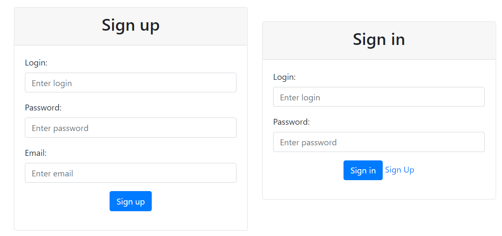
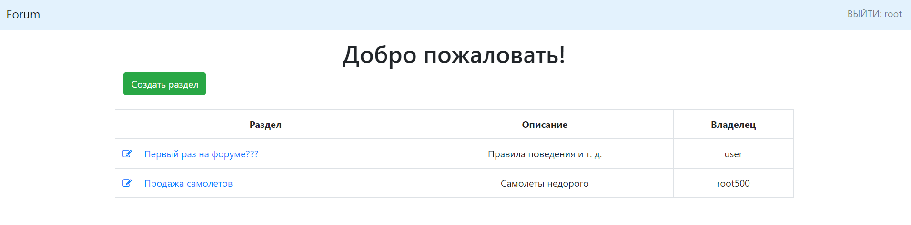
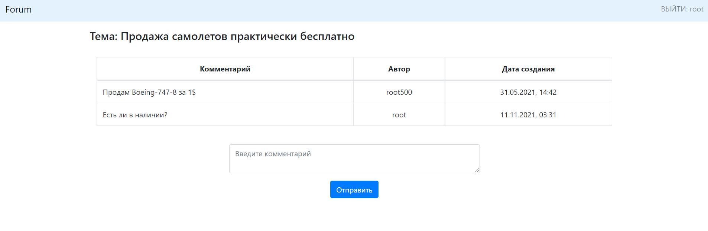

# Forum
The project is a classic application - a forum. The web application allows you to create topics and leave comments on them. Work in the application is available only to authorized users.

## Technologies used

- Spring, Spring Boot, Spring MVC
- Spring Data JPA, PostgreSQL, Liquibase 
- Spring Security
- JSP, JSTL
- HTML, Bootstrap
- Mockito, Junit
### Functionality

- Authorization and registration

 - Create and view forum topics
 

 - View and add a comment to the current topic

